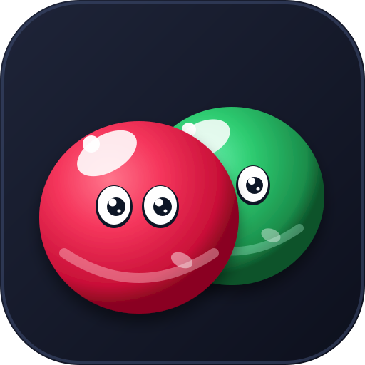
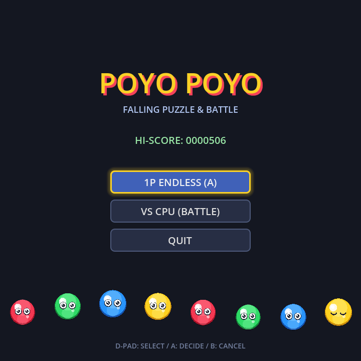
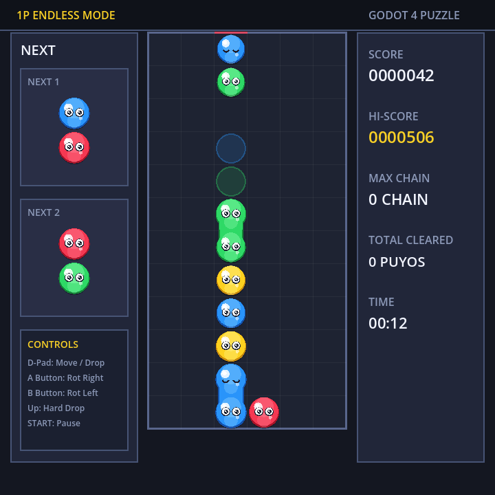
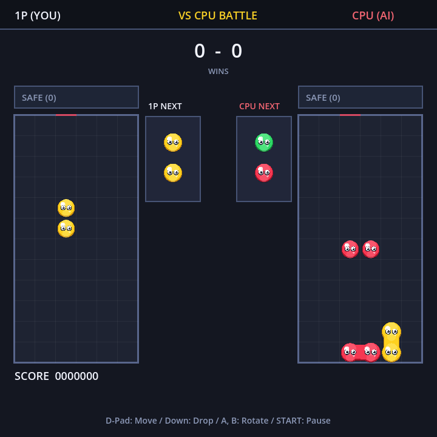

# PoyoPoyo (ぽよぽよ) 🎮

<div align="center">
  
  <br />
  <strong>正方形画面 (720×720) ＆ 物理コントローラー特化 落ち物パズルゲーム</strong>
  <br />
  <em>Made with Godot Engine 4.x</em>
</div>

---

## 📸 スクリーンショット

<div align="center">
  <table>
    <tr>
      <td align="center"><b>タイトル画面 (アトラクトデモ対応)</b></td>
      <td align="center"><b>1P ENDLESS (とことんモード)</b></td>
    </tr>
    <tr>
      <td></td>
      <td></td>
    </tr>
    <tr>
      <td colspan="2" align="center"><b>VS CPU (AI対戦・お邪魔相殺・34px大迫力フィールド)</b></td>
    </tr>
    <tr>
      <td colspan="2" align="center"></td>
    </tr>
  </table>
</div>

---

## 🌟 主な特徴

- **1P ENDLESS（とことんモード）**
  - ハイスコアと最大連鎖を目指してひたすら積む1P専用モード。
  - ハイスコアはローカルストレージ（`user://highscore.save`）へ自動保存。
- **VS CPU（対戦モード）**
  - 自律思考型AI（ヒューリスティック評価・全合法手シミュレーション）を搭載した対戦モード。
  - お邪魔ぷよの送り合い、**相殺（Offsetting）システム**、上空からの重力落下アニメーションを完全実装。
  - お邪魔ぷよは丸いぷよと区別しやすい **四角い立体石ブロック（岩）** デザイン。
- **アトラクト・デモモード（CPU vs CPU）**
  - タイトル画面で8秒間無操作のとき自動で開始されるCPU同士の対戦デモプレイ。
  - いずれかのボタンを押すだけで即座にタイトル画面へ復帰。
- **シームレスな有機的ゼリー結合**
  - 同色ぷよ同士が接触すると、外枠がひと繋がりになり **カプセル／ひょうたん型スライム** として滑らかに融合。
  - ちぎり落下（自由落下）時は着地するまで結合せず、着地した瞬間にぷるんと吸着。
- **アーケードライクな操作フィール**
  - 自作タイマーによる **DAS（長押し判定: 0.18秒）** と **ARR（連続移動間隔: 0.033秒）** 制御。
  - 壁際や接地ブロックに挟まれた際の **壁蹴り補正（Kick）**。
- **リッチなプロシージャルグラフィックス**
  - みずみずしい多層ジェリーシェーディング（立体シャドウ・インナーグロー・リムライト・グロス光沢）。
  - 潤んだ目と自然な **まばたき・表情変化**（消去時は「＞＜」の痛がり目に変化）。
  - ぷよ消去時の膨張・振動・弾けるスプラッシュパーティクル＆ショックウェーブリング。
- **完全物理ボタン・コントローラー対応**
  - タイトル、ポーズ、ゲームオーバー、対戦リザルトの全UIでフォーカスループを完備（マウス・タッチ操作不要）。

---

## 🕹️ 操作方法

| 操作 | ゲームパッド (RG Rotate) | キーボード |
| :--- | :--- | :--- |
| **左右移動** | D-Pad 左右 | `←` / `→` または `A` / `D` (DAS/ARR対応) |
| **高速落下 (Soft Drop)** | D-Pad 下 | `↓` または `S` |
| **即時接地 (Hard Drop)** | D-Pad 上 | `↑` または `W` |
| **右回転 (Rotate Right)** | A ボタン | `X` または `K` |
| **左回転 (Rotate Left)** | B ボタン | `Z` または `J` |
| **ポーズ (Pause)** | START ボタン | `Escape` または `P` |
| **UI決定 / 再挑戦** | A ボタン | `Enter` / `Space` / `X` |
| **UI戻る** | B ボタン | `Escape` / `Z` |

---

## 📐 画面・フィールド設計（720×720 正方形）

- **解像度**: 720 × 720 px（アスペクト比 1:1）
- **ストレッチモード**: `canvas_items` / `keep`
- **1P ENDLESS**:
  - フィールド: 横6列 × 縦13段（表示12段 ＋ 出現・窒息枠1段、1マス 52×52px）
  - 左パネル: NEXT1 / NEXT2 表示 ＆ 操作ガイド
  - 右パネル: SCORE / HI-SCORE / MAX CHAIN / TIME
- **VS CPU**:
  - 左: 1Pフィールド (セル 34×34px) / 右: CPUフィールド
  - 中央: 1P・CPU NEXT / 勝敗カウント / お邪魔予告トレイ（頭上）

---

## 📁 ディレクトリ構成

```text
poyopoyo/
├── project.godot            # プロジェクト設定・InputMap・解像度 (720x720)
├── export_presets.cfg       # Android向けエクスポート設定
├── icon.svg                 # キュートなジェリーぷよアプリアイコン
├── docs/
│   └── images/              # README用スクリーンショット・アイコン
├── scenes/
│   ├── TitleScreen.tscn     # タイトル画面（1P ENDLESS / VS CPU / QUIT）
│   ├── MainGame.tscn        # 1Pエンドレスメインシーン
│   ├── BattleGame.tscn      # VS CPU対戦メインシーン
│   └── PauseMenu.tscn       # ポーズメニューモーダル
└── scripts/
    ├── GameConstants.gd     # グリッド、カラーパレット、DAS/ARR、スコア計算テーブル
    ├── InputHandler.gd      # DAS/ARR制御・コントローラー入力ハンドラー
    ├── GridModel.gd         # 6x13盤面管理・BFS連結消去・自由落下ロジック
    ├── MainGame.gd          # 1Pゲーム進行・プロシージャル描画・セーブ管理
    ├── BattlePlayer.gd      # 対戦プレイヤー状態・お邪魔ぷよ落下物理
    ├── BattleGame.gd        # 対戦メインループ・相殺・2面描画統括
    ├── PuyoAI.gd            # CPU思考エンジン（候補手探索・盤面評価）
    ├── PauseMenu.gd         # ポーズ画面フォーカス制御
    └── TitleScreen.gd       # タイトル画面フォーカス制御・背景アニメーション
```

---

## 🚀 ビルド＆実行方法

### PCで実行する場合
1. [Godot Engine 4.x](https://godotengine.org/) をダウンロード・起動。
2. `project.godot` をインポートして実行。

### Android / RG Rotate へインストールする場合
```bash
# APKをエクスポート
godot --headless --export-debug "Android" "build/poyopoyo.apk"

# USB接続した端末へインストール
adb install -r build/poyopoyo.apk
```

---

## 📄 ライセンス

MIT License

